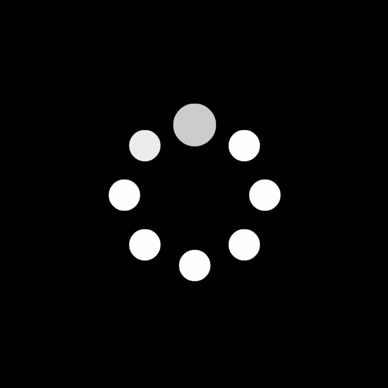

  

<h1 align="center">Keeps Loading</h1>

  
  
  
  

---

## Ongoing Work

**Memact**  
A place where you can finally see what apps know about you.

I am building Memact as a user-controlled memory layer for apps. Apps can bring context, but users decide what stays, what changes, and what gets removed.

## Previous Work

**Cognitive Firewall**  
A local-first tool for spotting influence pressure in online content. It analyzes visible language patterns across webpages, social feeds, and video page metadata with deterministic scoring and evidence-linked explanations.

**Endlessly**  
A small Tkinter endless-runner prototype built in the first few minutes of the IIT Bombay GenAI Hackathon, before we risked the rest of our time on Cognitive Firewall.

**Memact AutoMod Discord Bot**  
A moderation and utility bot built for the Memact Discord server.
